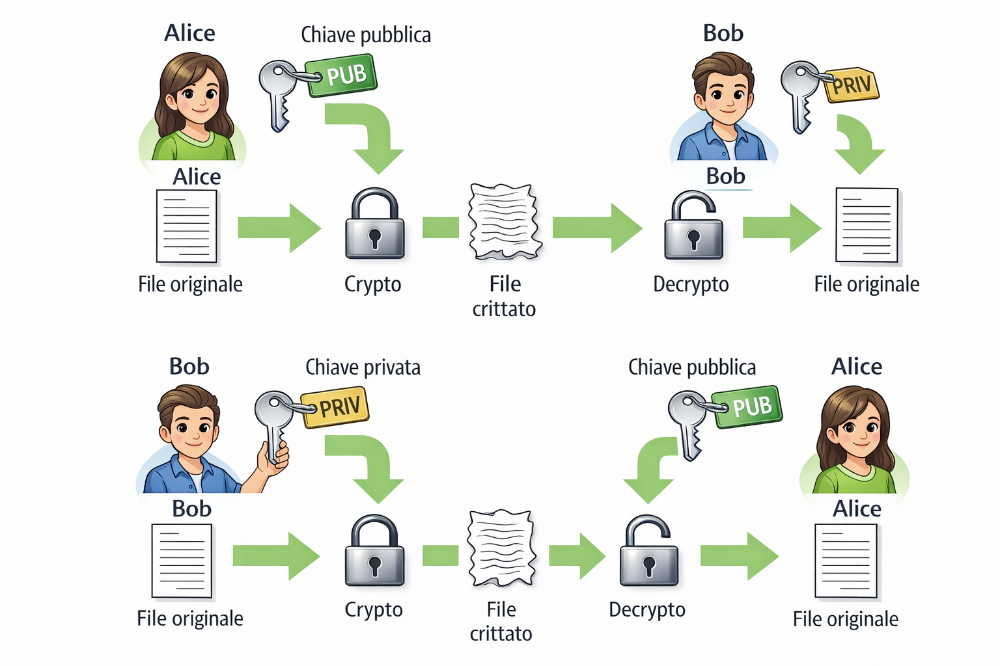

# Guida Git e GitHub per Web4Student

## Introduzione

Git è un sistema di controllo versione che permette di:
- Tenere traccia delle modifiche al codice
- Collaborare con altri sviluppatori
- Tornare a versioni precedenti del progetto
- Gestire branch per sviluppare funzionalità separate

GitHub è una piattaforma online che ospita repository Git e facilita la collaborazione.

---

## Setup iniziale

### Accesso al server
```bash
ssh cognome.nome@w4s.filippobilardo.it -p 2222
```

### Configurazione Git (da fare una sola volta)
```bash
# Imposta il tuo nome (sarà visibile nei commit)
git config --global user.name "TuoNome Cognome"

# Imposta la tua email (usa quella di GitHub)
git config --global user.email "tua.email@example.com"

# Imposta il branch predefinito come 'main'
git config --global init.defaultBranch main

# Verifica la configurazione
git config --list
```

### Configurazione chiave SSH (da fare una sola volta)

La chiave SSH permette di autenticarti su GitHub senza inserire password ogni volta.
Puoi anche utilizzare una chiave creata in precedenza, ma assicurati che la chiave pubblica sia aggiunta al tuo account GitHub.
Per il collegamento con GitHub, si consiglia di non usare passphrase per evitare problemi di autenticazione automatica.

```bash
# Genera una chiave SSH (premi INVIO per tutto)
ssh-keygen -t ed25519 -C "tua.email@example.com"

# Visualizza la chiave pubblica
cat ~/.ssh/id_ed25519.pub
```

**Copia l'intera chiave pubblica** (inizia con `ssh-ed25519...`) e aggiungila su GitHub:
1. Vai su https://github.com/settings/keys
2. Clicca su "New SSH key"
3. Dai un titolo (es: "Web4Student Server")
4. Incolla la chiave nel campo "Key"
5. Clicca "Add SSH key"

**Testa la connessione:**
```bash
ssh -T git@github.com
```

Dovresti vedere: `Hi tuousername! You've successfully authenticated...`

--- 

### Utilizzo delle chiavi privata e pubblica
Nel collegamento con GitHub, l'utente usa la chiave privata per autenticarsi. La chiave pubblica viene condivisa con GitHub per permettere l'autenticazione.


---

## Collegare un progetto esistente a GitHub

### Passo 1: Vai nella cartella del progetto che vuoi caricare su GitHub
```bash
cd ~/nome-cartella-progetto
```

### Passo 2: Inizializza Git
```bash
git init
```

### Passo 3: Aggiungi i file al repository
```bash
# Verifica quali file sono presenti
ls -la

# Se non è presente nessun file creane uno. Ad es.:
echo "Descrizione del progetto" > README.md

# Aggiungi tutti i file
git add .

# Verifica lo stato
git status
```

### Passo 4: Crea il primo commit
```bash
git commit -m "Primo commit - nome del progetto"
```

### Passo 5: Crea il repository su GitHub
1. Vai su https://github.com/new
2. Inserisci il nome del repository (es: `mio-progetto`)
3. **IMPORTANTE:** Lascia deselezionato tutto (no README, no .gitignore, no licenza)
4. Clicca "Create repository"

### Passo 6: Collega il repository remoto
```bash
# Sostituisci 'tuousername' e 'nome-repo' con i tuoi dati
git remote add origin git@github.com:tuousername/nome-repo.git

# Verifica la configurazione
git remote -v
```

### Passo 7: Carica il progetto su GitHub
```bash
# Rinomina il branch in 'main' (se necessario)
git branch -M main

# Carica i file su GitHub
git push -u origin main
```

✅ **Fatto!** Il tuo progetto è ora su GitHub.

---

## Comandi Git fondamentali

### Verifica dello stato
```bash
# Mostra lo stato dei file (modificati, aggiunti, etc.)
git status

# Mostra la cronologia dei commit
git log

# Mostra la cronologia in formato compatto
git log --oneline

# Mostra le differenze non ancora committate
git diff
```

### Aggiungere file
```bash
# Aggiungi un file specifico
git add nomefile.txt

# Aggiungi tutti i file modificati
git add .

# Aggiungi tutti i file con una specifica estensione
git add *.cpp

# Aggiungi tutti i file in una cartella
git add src/
```

### Committare modifiche
```bash
# Commit con messaggio
git commit -m "Descrizione delle modifiche"

# Commit con messaggio dettagliato (si apre l'editor)
git commit

# Modifica l'ultimo commit (se non hai ancora fatto push)
git commit --amend -m "Nuovo messaggio"
```

### Sincronizzazione con GitHub
```bash
# Scarica le modifiche dal repository remoto
git pull origin main

# Carica le tue modifiche su GitHub
git push origin main

# Dopo il primo push, puoi usare semplicemente
git push
```

---

## Workflow tipico

Ecco il flusso di lavoro standard quando lavori su un progetto:

```bash
# 1. Vai nella cartella del progetto
cd ~/mio-progetto

# 2. Scarica eventuali aggiornamenti (se lavori in team)
git pull

# 3. Lavora sui file...
# (modifica, crea, elimina file)

# 4. Verifica cosa è cambiato
git status

# 5. Aggiungi i file modificati
git add .

# 6. Committa con un messaggio descrittivo
git commit -m "Aggiunta funzionalità X"

# 7. Carica su GitHub
git push
```

### Messaggi di commit efficaci

❌ **Cattivi esempi:**
- "fix"
- "aggiornamento"
- "modifiche varie"

✅ **Buoni esempi:**
- "Aggiunta validazione form contatti"
- "Corretta gestione errori nel login"
- "Implementato sistema di paginazione"
- "Aggiornata documentazione API"

---

## Comandi avanzati

### Gestione branch
```bash
# Visualizza tutti i branch
git branch

# Crea un nuovo branch
git branch nome-feature

# Passa a un branch
git checkout nome-feature

# Crea e passa a un nuovo branch (comando combinato)
git checkout -b nome-feature

# Unisci un branch nel branch corrente
git merge nome-feature

# Elimina un branch locale
git branch -d nome-feature

# Elimina un branch remoto
git push origin --delete nome-feature
```

### Annullare modifiche
```bash
# Annulla modifiche non ancora aggiunte (git add)
git checkout -- nomefile.txt

# Rimuovi file dall'area di staging (ma mantieni le modifiche)
git reset nomefile.txt

# Torna all'ultimo commit (ATTENZIONE: perdi tutte le modifiche)
git reset --hard HEAD

# Annulla l'ultimo commit (mantieni le modifiche)
git reset --soft HEAD~1
```

### File .gitignore

Crea un file `.gitignore` per escludere file dal repository:

```bash
# Crea il file
nano .gitignore
```

Esempio di contenuto:
```
# File compilati
*.o
*.exe
a.out

# File temporanei
*.tmp
*.swp
*~

# Cartelle
node_modules/
.vscode/
build/

# File di configurazione locale
config.local.php
.env
```

### Clonare un repository esistente
```bash
# Clona un repository da GitHub
git clone git@github.com:username/repository.git

# Clona in una cartella specifica
git clone git@github.com:username/repository.git nome-cartella
```

### Visualizzare la cronologia
```bash
# Log dettagliato
git log

# Log compatto
git log --oneline

# Log con grafico dei branch
git log --graph --oneline --all

# Mostra le modifiche di un commit specifico
git show <commit-hash>

# Mostra chi ha modificato ogni riga di un file
git blame nomefile.txt
```

### Stash (salvare modifiche temporanee)
```bash
# Salva le modifiche correnti senza committare
git stash

# Visualizza gli stash salvati
git stash list

# Ripristina l'ultimo stash
git stash pop

# Applica uno stash specifico
git stash apply stash@{0}

# Elimina tutti gli stash
git stash clear
```

---

## Risoluzione problemi comuni

### Problema: "Updates were rejected because the remote contains work..."

**Causa:** Il repository remoto ha commit che non hai localmente.

**Soluzione:**
```bash
git pull origin main --rebase
git push origin main
```

### Problema: "fatal: not a git repository"

**Causa:** Non sei in una cartella con repository Git.

**Soluzione:**
```bash
# Verifica di essere nella cartella giusta
pwd
ls -la  # Cerca la cartella .git

# Se necessario, inizializza Git
git init
```

### Problema: Conflitti durante il merge

**Cosa fare:**
1. Git ti avviserà dei file in conflitto
2. Apri i file e cerca le sezioni marcate con `<<<<<<<`, `=======`, `>>>>>>>`
3. Risolvi manualmente i conflitti
4. Aggiungi i file risolti: `git add nomefile.txt`
5. Completa il merge: `git commit`

### Problema: Ho committato file sbagliati

**Soluzione:**
```bash
# Se NON hai ancora fatto push
git reset --soft HEAD~1  # Annulla l'ultimo commit
git reset nomefile.txt   # Rimuovi file specifici dallo staging
git commit -m "Commit corretto"

# Se hai già fatto push (evita se possibile)
git revert HEAD
git push
```

### Problema: Password authentication not supported

**Causa:** GitHub non accetta più password per HTTPS.

**Soluzione:** Usa SSH (vedi sezione Setup iniziale) oppure cambia URL:
```bash
git remote set-url origin git@github.com:username/repository.git
```

---

## Best practices

### 1. Commit frequenti e atomici
- Fai commit piccoli e focalizzati
- Ogni commit dovrebbe rappresentare un'unità logica di lavoro
- Committa spesso, anche più volte al giorno

### 2. Messaggi di commit chiari
- Prima riga: sommario breve (max 50 caratteri)
- Usa il tempo presente: "Aggiunge" non "Aggiunto"
- Se necessario, aggiungi dettagli dopo una riga vuota

### 3. Pull prima di push
```bash
# Sempre prima di fare push
git pull
git push
```

### 4. Non committare file sensibili
- Password, chiavi API, token
- File di configurazione con dati personali
- Usa `.gitignore` per escluderli

### 5. Usa branch per nuove funzionalità
```bash
# Crea un branch per ogni nuova feature
git checkout -b feature-login
# Lavora sulla feature...
git commit -m "Implementato sistema di login"
# Torna sul main e unisci
git checkout main
git merge feature-login
```

### 6. Controlla sempre prima di committare
```bash
git status  # Cosa sto per committare?
git diff    # Quali modifiche ho fatto?
```

### 7. Backup regolari su GitHub
```bash
# Push almeno una volta al giorno
git push
```

---

## Comandi di riferimento rapido

```bash
# Configurazione iniziale
git config --global user.name "Nome"
git config --global user.email "email@example.com"

# Setup progetto
git init
git add .
git commit -m "Primo commit"
git remote add origin git@github.com:user/repo.git
git push -u origin main

# Workflow quotidiano
git status
git add .
git commit -m "Descrizione"
git push

# Sincronizzazione
git pull
git push

# Branch
git branch               # Lista branch
git checkout -b nuovo    # Crea e passa a nuovo branch
git merge nome-branch    # Unisci branch

# Cronologia
git log
git log --oneline
git diff

# Annullare
git checkout -- file     # Annulla modifiche non committate
git reset HEAD file      # Rimuovi da staging
git reset --soft HEAD~1  # Annulla ultimo commit
```

---

## Esercizi proposti

### Esercizio 1: Setup base
1. Configura Git con nome ed email
2. Genera una chiave SSH e aggiungila a GitHub
3. Testa la connessione con `ssh -T git@github.com`

### Esercizio 2: Primo repository
1. Crea una cartella con alcuni file di test
2. Inizializza Git
3. Crea il primo commit
4. Crea un repository su GitHub e carica i file

### Esercizio 3: Modifiche e sincronizzazione
1. Modifica alcuni file nel progetto
2. Aggiungi nuovi file
3. Committa le modifiche con un messaggio appropriato
4. Fai push su GitHub

### Esercizio 4: Gestione branch
1. Crea un nuovo branch `sviluppo`
2. Fai alcune modifiche nel branch
3. Torna al branch `main`
4. Unisci il branch `sviluppo` in `main`

### Esercizio 5: .gitignore
1. Crea un file `.gitignore`
2. Escludi file con estensione `.log` e `.tmp`
3. Verifica con `git status` che i file vengano ignorati

---

## Domande di autovalutazione

**1. Quale comando serve per inizializzare un repository Git?**
- A) `git start`
- B) `git init`
- C) `git create`
- D) `git new`

**2. Come si aggiungono tutti i file modificati all'area di staging?**
- A) `git commit .`
- B) `git push .`
- C) `git add .`
- D) `git stage .`

**3. Quale comando sincronizza il repository locale con quello remoto su GitHub?**
- A) `git sync`
- B) `git upload`
- C) `git push`
- D) `git send`

**4. Come si visualizza lo stato corrente del repository?**
- A) `git info`
- B) `git status`
- C) `git state`
- D) `git check`

**5. Quale file si usa per escludere determinati file dal repository?**
- A) `.gitexclude`
- B) `.gitignore`
- C) `.exclude`
- D) `.ignore`

**6. Come si crea un nuovo branch chiamato "sviluppo"?**
- A) `git new sviluppo`
- B) `git create branch sviluppo`
- C) `git branch sviluppo`
- D) `git checkout sviluppo`

**7. Quale comando scarica le modifiche dal repository remoto?**
- A) `git download`
- B) `git fetch`
- C) `git pull`
- D) `git sync`

**8. Come si annullano le modifiche non committate di un file?**
- A) `git reset nomefile`
- B) `git undo nomefile`
- C) `git checkout -- nomefile`
- D) `git revert nomefile`

**9. Quale protocollo è consigliato per autenticarsi su GitHub?**
- A) HTTP
- B) HTTPS con password
- C) SSH
- D) FTP

**10. Come si visualizza la cronologia dei commit?**
- A) `git history`
- B) `git log`
- C) `git commits`
- D) `git show`

---

## Risposte alle domande di autovalutazione

**1. B** - `git init` inizializza un nuovo repository Git nella cartella corrente, creando la cartella nascosta `.git` che contiene tutti i metadati del repository.

**2. C** - `git add .` aggiunge tutti i file modificati, nuovi o eliminati all'area di staging, preparandoli per il commit. Il punto (.) indica "tutti i file nella cartella corrente e sottocartelle".

**3. C** - `git push` carica i commit locali sul repository remoto (GitHub). Con l'opzione `-u origin main` nel primo push si imposta il tracking del branch remoto.

**4. B** - `git status` mostra lo stato del repository: file modificati, file in staging, file non tracciati e la posizione rispetto al repository remoto.

**5. B** - `.gitignore` è un file speciale che contiene pattern di file e cartelle da escludere dal tracciamento di Git. Deve essere committato nel repository per funzionare.

**6. C** - `git branch sviluppo` crea un nuovo branch. Per creare e passare subito al nuovo branch si usa `git checkout -b sviluppo`.

**7. C** - `git pull` scarica le modifiche dal repository remoto e le unisce automaticamente nel branch corrente. È equivalente a `git fetch` seguito da `git merge`.

**8. C** - `git checkout -- nomefile` ripristina il file allo stato dell'ultimo commit, annullando tutte le modifiche non committate. I due trattini evitano ambiguità con i nomi dei branch.

**9. C** - SSH è il metodo consigliato perché è più sicuro e non richiede di inserire credenziali ad ogni operazione. GitHub non supporta più l'autenticazione HTTPS con password.

**10. B** - `git log` mostra la cronologia completa dei commit. Con `git log --oneline` si ottiene una visualizzazione compatta, con `git log --graph` si visualizza il grafico dei branch.

---

## Risorse utili

- **Documentazione ufficiale Git:** https://git-scm.com/doc
- **GitHub Docs:** https://docs.github.com
- **Git Cheat Sheet:** https://education.github.com/git-cheat-sheet-education.pdf
- **Visualizzatore Git interattivo:** https://git-school.github.io/visualizing-git/