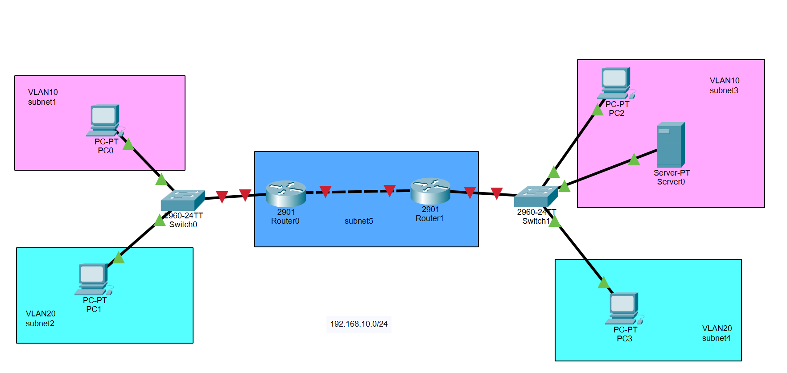

# Esercitazione Configurazione Topologia di rete con VLAN e Inter-VLAN Routing


## Obiettivo
L'obiettivo di questa esercitazione è configurare una rete con VLAN (Virtual Local Area Network) e consentire la comunicazione tra le reti VLAN utilizzando router Cisco. In particolare, si configureranno due VLAN (VLAN 10 e VLAN 20) e si abiliterà la comunicazione tra di esse tramite routing inter-VLAN.

**Compito**: Suddividere la rete 192.168.10.0/24 in 5 sottoreti e configurare le VLAN per ciascuna sottorete come da immagine sopra.

### Documentazione richiesta

| # | Screenshot | STEP |
|---|-----------|------|
| 📸 1 | Tabella subnetting compilata | STEP 1 |
| 📸 2 | Layout dispositivi posizionati | STEP 2.1 |
| 📸 3 | Topologia completa con cavi collegati e link verdi | STEP 2.2 |
| 📸 4 | IP Configuration di almeno 2 PC | STEP 3 |
| 📸 5 | CLI Router0 — `show ip interface brief` | STEP 4 |
| 📸 6 | CLI Router1 — `show ip interface brief` | STEP 5 |
| 📸 7 | CLI Switch0 — `show vlan brief` | STEP 6 |
| 📸 8 | CLI Switch1 — `show vlan brief` | STEP 7 |
| 📸 9 | Ping e traceroute da PC0 | STEP 8 |
| 📸 10 | Salvataggio file `.pkt` | STEP 9 |

## Architettura

### Dispositivi
- 2x Router Cisco 2901 (Router0 e Router1)
- 2x Switch Cisco 2960-24TT (Switch0 e Switch1)
- 4x PC Client (PC0, PC1, PC2, PC3)
- 1x Server (Server0)

### Topologia
- **Switch0** (lato sinistro): collega PC0 (VLAN10) e PC1 (VLAN20) → collegato a Router0 su Gi0/0
- **Switch1** (lato destro): collega PC2 (VLAN10), PC3 (VLAN20) e Server0 (VLAN10) → collegato a Router1 su Gi0/0
- **Backbone centrale**: Router0 e Router1 collegati tramite interfacce **GigabitEthernet0/1**

### VLAN Configurate
- **VLAN 10** (viola/rosa): PC0, PC2, Server0
- **VLAN 20** (ciano): PC1, PC3

---

## STEP 1: Suddivisione della rete in sottoreti

Per suddividere la rete **192.168.10.0/24** in **5 sottoreti**, utilizziamo il subnetting con maschera **/27** (255.255.255.224), che fornisce 32 indirizzi IP per sottorete (30 utilizzabili).

### Schema delle 5 Sottoreti

| Sottorete | Indirizzo Rete | Range Host Utilizzabili | Indirizzo Broadcast | Dispositivi | VLAN |
|-----------|----------------|-------------------------|---------------------|-------------|------|
| **subnet1** | 192.168.10.0/27 | 192.168.10.1 - 192.168.10.30 | **192.168.10.31** | PC0 | VLAN10 |
| **subnet2** | 192.168.10.32/27 | 192.168.10.33 - 192.168.10.62 | **192.168.10.63** | PC1 | VLAN20 |
| **subnet3** | 192.168.10.64/27 | 192.168.10.65 - 192.168.10.94 | **192.168.10.95** | PC2, Server0 | VLAN10 |
| **subnet4** | 192.168.10.96/27 | 192.168.10.97 - 192.168.10.126 | **192.168.10.127** | PC3 | VLAN20 |
| **subnet5** | 192.168.10.128/27 | 192.168.10.129 - 192.168.10.158 | **192.168.10.159** | Backbone Router0-Router1 | - |

> 📸 **Screenshot 1** — Inserisci qui una foto/screenshot del calcolo delle sottoreti (tabella compilata a mano o su foglio elettronico).

### Piano di Indirizzamento Dettagliato

| Dispositivo | Interfaccia | Indirizzo IP | Subnet Mask | Gateway | VLAN | Sottorete |
|-------------|-------------|--------------|-------------|---------|------|-----------|
| **PC0** | FastEthernet0 | 192.168.10.10 | 255.255.255.224 | 192.168.10.1 | VLAN10 | subnet1 |
| **PC1** | FastEthernet0 | 192.168.10.42 | 255.255.255.224 | 192.168.10.33 | VLAN20 | subnet2 |
| **PC2** | FastEthernet0 | 192.168.10.74 | 255.255.255.224 | 192.168.10.65 | VLAN10 | subnet3 |
| **PC3** | FastEthernet0 | 192.168.10.106 | 255.255.255.224 | 192.168.10.97 | VLAN20 | subnet4 |
| **Server0** | FastEthernet0 | 192.168.10.75 | 255.255.255.224 | 192.168.10.65 | VLAN10 | subnet3 |
| **Router0** | Gi0/0.10 (VLAN10) | 192.168.10.1 | 255.255.255.224 | - | VLAN10 | subnet1 |
| **Router0** | Gi0/0.20 (VLAN20) | 192.168.10.33 | 255.255.255.224 | - | VLAN20 | subnet2 |
| **Router0** | GigabitEthernet0/1 | 192.168.10.129 | 255.255.255.224 | - | - | subnet5 |
| **Router1** | Gi0/0.10 (VLAN10) | 192.168.10.65 | 255.255.255.224 | - | VLAN10 | subnet3 |
| **Router1** | Gi0/0.20 (VLAN20) | 192.168.10.97 | 255.255.255.224 | - | VLAN20 | subnet4 |
| **Router1** | GigabitEthernet0/1 | 192.168.10.130 | 255.255.255.224 | - | - | subnet5 |

---

## STEP 2: Creazione Topologia in Cisco Packet Tracer

### 2.1 Posizionamento Dispositivi

1. Apri **Cisco Packet Tracer**
2. Dal pannello dispositivi in basso:
   - Seleziona **Routers** → **2900 Series** → trascina **2901** (x2)
   - Seleziona **Switches** → **2960** → trascina **2960-24TT** (x2)
   - Seleziona **End Devices** → trascina **PC** (x4)
   - Seleziona **End Devices** → trascina **Server** (x1)

3. **Layout suggerito:**
```
                Router0 -----(Gi0/1)------ Router1
                   |                           |
               (Gi0/0)                      (Gi0/0)
                   |                           |
               [Switch0]                   [Switch1]
                 /    \                     /   |   \
                /      \                   /    |    \
              PC0      PC1              PC2  Server0  PC3
           (VLAN10) (VLAN20)         (VLAN10)(VLAN10)(VLAN20)
```

> 📸 **Screenshot 2** — Layout dispositivi posizionati e rinominati nella workspace di Packet Tracer.

---

### 2.2 Collegamento Cavi

#### Switch0

| Da Dispositivo | Porta | Tipo Cavo | A Dispositivo | Porta |
|----------------|-------|-----------|---------------|-------|
| PC0 | FastEthernet0 | Copper Straight-Through | Switch0 | FastEthernet0/1 |
| PC1 | FastEthernet0 | Copper Straight-Through | Switch0 | FastEthernet0/2 |
| Switch0 | GigabitEthernet0/1 | Copper Straight-Through | Router0 | GigabitEthernet0/0 |

#### Switch1

| Da Dispositivo | Porta | Tipo Cavo | A Dispositivo | Porta |
|----------------|-------|-----------|---------------|-------|
| PC2 | FastEthernet0 | Copper Straight-Through | Switch1 | FastEthernet0/1 |
| Server0 | FastEthernet0 | Copper Straight-Through | Switch1 | FastEthernet0/2 |
| PC3 | FastEthernet0 | Copper Straight-Through | Switch1 | FastEthernet0/3 |
| Switch1 | GigabitEthernet0/1 | Copper Straight-Through | Router1 | GigabitEthernet0/0 |

#### Backbone Router0 ↔ Router1

| Da Dispositivo | Porta | Tipo Cavo | A Dispositivo | Porta |
|----------------|-------|-----------|---------------|-------|
| Router0 | **GigabitEthernet0/1** | Copper Cross-Over | Router1 | **GigabitEthernet0/1** |

> 📸 **Screenshot 3** — Topologia completa con tutti i cavi collegati e i link verdi (interfacce attive).

---

## STEP 3: Configurazione PC e Server

### PC0 (VLAN 10 - subnet1)

1. Click su **PC0** → tab **Desktop** → **IP Configuration**
2. Seleziona **Static**
3. Inserisci:
   - **IP Address**: `192.168.10.10`
   - **Subnet Mask**: `255.255.255.224`
   - **Default Gateway**: `192.168.10.1`

### PC1 (VLAN 20 - subnet2)

1. Click su **PC1** → tab **Desktop** → **IP Configuration**
2. Seleziona **Static**
3. Inserisci:
   - **IP Address**: `192.168.10.42`
   - **Subnet Mask**: `255.255.255.224`
   - **Default Gateway**: `192.168.10.33`

### PC2 (VLAN 10 - subnet3)

1. Click su **PC2** → tab **Desktop** → **IP Configuration**
2. Seleziona **Static**
3. Inserisci:
   - **IP Address**: `192.168.10.74`
   - **Subnet Mask**: `255.255.255.224`
   - **Default Gateway**: `192.168.10.65`

### PC3 (VLAN 20 - subnet4)

1. Click su **PC3** → tab **Desktop** → **IP Configuration**
2. Seleziona **Static**
3. Inserisci:
   - **IP Address**: `192.168.10.106`
   - **Subnet Mask**: `255.255.255.224`
   - **Default Gateway**: `192.168.10.97`

### Server0 (VLAN 10 - subnet3)

1. Click su **Server0** → tab **Desktop** → **IP Configuration**
2. Seleziona **Static**
3. Inserisci:
   - **IP Address**: `192.168.10.75`
   - **Subnet Mask**: `255.255.255.224`
   - **Default Gateway**: `192.168.10.65`

> 📸 **Screenshot 4** — Finestra IP Configuration di almeno 2 PC (es. PC0 e PC3) con i campi compilati.

---

## STEP 4: Configurazione Router0

1. Click su **Router0** → tab **CLI**
2. Premi **Enter** (salta auto-install)
3. Copia e incolla la seguente configurazione:

```cisco
enable
configure terminal
hostname Router0

! Configurazione interfaccia backbone GigabitEthernet verso Router1 (subnet5)
interface GigabitEthernet0/1
ip address 192.168.10.129 255.255.255.224
no shutdown
exit

! Configurazione subinterface per VLAN10 (subnet1)
interface GigabitEthernet0/0.10
encapsulation dot1Q 10
ip address 192.168.10.1 255.255.255.224
description Gateway VLAN10 - subnet1
exit

! Configurazione subinterface per VLAN20 (subnet2)
interface GigabitEthernet0/0.20
encapsulation dot1Q 20
ip address 192.168.10.33 255.255.255.224
description Gateway VLAN20 - subnet2
exit

! Attivazione interfaccia fisica verso Switch0
interface GigabitEthernet0/0
no shutdown
exit

! Routing statico verso subnet3 e subnet4 (via Router1)
ip route 192.168.10.64 255.255.255.224 192.168.10.130
ip route 192.168.10.96 255.255.255.224 192.168.10.130

end
write memory
```

4. Attendi il messaggio `[OK]` per la conferma del salvataggio.

> 📸 **Screenshot 5** — CLI di Router0 con il comando `show ip interface brief` che mostra tutte le interfacce **up/up**.

---

## STEP 5: Configurazione Router1

1. Click su **Router1** → tab **CLI**
2. Premi **Enter** (salta auto-install)
3. Copia e incolla la seguente configurazione:

```cisco
enable
configure terminal
hostname Router1

! Configurazione interfaccia backbone GigabitEthernet verso Router0 (subnet5)
interface GigabitEthernet0/1
ip address 192.168.10.130 255.255.255.224
no shutdown
exit

! Configurazione subinterface per VLAN10 (subnet3)
interface GigabitEthernet0/0.10
encapsulation dot1Q 10
ip address 192.168.10.65 255.255.255.224
description Gateway VLAN10 - subnet3
exit

! Configurazione subinterface per VLAN20 (subnet4)
interface GigabitEthernet0/0.20
encapsulation dot1Q 20
ip address 192.168.10.97 255.255.255.224
description Gateway VLAN20 - subnet4
exit

! Attivazione interfaccia fisica verso Switch1
interface GigabitEthernet0/0
no shutdown
exit

! Routing statico verso subnet1 e subnet2 (via Router0)
ip route 192.168.10.0 255.255.255.224 192.168.10.129
ip route 192.168.10.32 255.255.255.224 192.168.10.129

end
write memory
```

4. Attendi il messaggio `[OK]` per la conferma del salvataggio.

> 📸 **Screenshot 6** — CLI di Router1 con il comando `show ip interface brief` che mostra tutte le interfacce **up/up**.

---

## STEP 6: Configurazione Switch0

1. Click su **Switch0** → tab **CLI**
2. Premi **Enter**
3. Copia e incolla la seguente configurazione:

```cisco
enable
configure terminal
hostname Switch0

! Creazione VLAN
vlan 10
name VLAN10_subnet1
exit
vlan 20
name VLAN20_subnet2
exit

! Configurazione porta trunk verso Router0
interface GigabitEthernet0/1
switchport mode trunk
switchport trunk allowed vlan 10,20
no shutdown
exit

! Configurazione porta per PC0 (VLAN10)
interface FastEthernet0/1
switchport mode access
switchport access vlan 10
description PC0 - VLAN10
no shutdown
exit

! Configurazione porta per PC1 (VLAN20)
interface FastEthernet0/2
switchport mode access
switchport access vlan 20
description PC1 - VLAN20
no shutdown
exit

end
write memory
```

4. Attendi il messaggio `[OK]` per la conferma del salvataggio.

> 📸 **Screenshot 7** — CLI di Switch0 con il comando `show vlan brief` che mostra VLAN10 e VLAN20 con le porte corrette.

---

## STEP 7: Configurazione Switch1

1. Click su **Switch1** → tab **CLI**
2. Premi **Enter**
3. Copia e incolla la seguente configurazione:

```cisco
enable
configure terminal
hostname Switch1

! Creazione VLAN
vlan 10
name VLAN10_subnet3
exit
vlan 20
name VLAN20_subnet4
exit

! Configurazione porta trunk verso Router1
interface GigabitEthernet0/1
switchport mode trunk
switchport trunk allowed vlan 10,20
no shutdown
exit

! Configurazione porta per PC2 (VLAN10)
interface FastEthernet0/1
switchport mode access
switchport access vlan 10
description PC2 - VLAN10
no shutdown
exit

! Configurazione porta per Server0 (VLAN10)
interface FastEthernet0/2
switchport mode access
switchport access vlan 10
description Server0 - VLAN10
no shutdown
exit

! Configurazione porta per PC3 (VLAN20)
interface FastEthernet0/3
switchport mode access
switchport access vlan 20
description PC3 - VLAN20
no shutdown
exit

end
write memory
```

4. Attendi il messaggio `[OK]` per la conferma del salvataggio.

> 📸 **Screenshot 8** — CLI di Switch1 con il comando `show vlan brief` che mostra VLAN10 e VLAN20 con le porte corrette.

---

## STEP 8: Verifica e Test della Configurazione

### 8.1 Verifica Interfacce Router

**Router0:**
```cisco
show ip interface brief
```

Output atteso:
```
Interface              IP-Address      Status    Protocol
GigabitEthernet0/0     unassigned      up        up
GigabitEthernet0/0.10  192.168.10.1    up        up
GigabitEthernet0/0.20  192.168.10.33   up        up
GigabitEthernet0/1     192.168.10.129  up        up
```

**Router0 - Verifica tabella di routing:**
```cisco
show ip route
```

Output atteso:
```
C    192.168.10.0/27  is directly connected, GigabitEthernet0/0.10
C    192.168.10.32/27 is directly connected, GigabitEthernet0/0.20
C    192.168.10.128/27 is directly connected, GigabitEthernet0/1
S    192.168.10.64/27 [1/0] via 192.168.10.130
S    192.168.10.96/27 [1/0] via 192.168.10.130
```

**Switch0 - Verifica VLAN:**
```cisco
show vlan brief
```

Output atteso:
```
VLAN Name                             Status    Ports
---- -------------------------------- --------- -------
1    default                          active    Fa0/3-24, Gi0/2
10   VLAN10_subnet1                   active    Fa0/1
20   VLAN20_subnet2                   active    Fa0/2
```

**Switch0 - Verifica trunk:**
```cisco
show interfaces trunk
```

Output atteso:
```
Port        Mode         Encapsulation  Status        Native vlan
Gi0/1       on           802.1q         trunking      1

Port        Vlans allowed on trunk
Gi0/1       10,20
```

### 8.2 Test Connettività - Ping

Da **PC0** → Desktop → Command Prompt:

| Test | Comando | Destinazione | Risultato Atteso |
|------|---------|--------------|-----------------|
| Ping gateway locale | `ping 192.168.10.1` | Router0 Gi0/0.10 | ✅ Success |
| Ping inter-VLAN stesso switch | `ping 192.168.10.42` | PC1 (VLAN20) | ✅ Success |
| Ping inter-switch stessa VLAN | `ping 192.168.10.74` | PC2 (VLAN10) | ✅ Success |
| Ping inter-switch inter-VLAN | `ping 192.168.10.106` | PC3 (VLAN20) | ✅ Success |
| Ping verso Server | `ping 192.168.10.75` | Server0 | ✅ Success |

### 8.3 Test Traceroute

Da **PC0**, tracciare il percorso verso PC3:
```
tracert 192.168.10.106
```

**Risultato atteso:**
```
1   192.168.10.1    (Router0 - Gateway VLAN10 su Gi0/0.10)
2   192.168.10.130  (Router1 - Gi0/1 backbone)
3   192.168.10.106  (PC3 - Destinazione)
```

> 📸 **Screenshot 9** — Risultati dei ping e del traceroute dal Command Prompt di PC0.

---

## STEP 9: Salvataggio File

Salva il file Packet Tracer con il comando **File → Save** (o Ctrl+S) con nome `es01a_vlan.pkt` e allegalo alla consegna.

> 📸 **Screenshot 10** — Schermata di salvataggio con il nome del file visibile, oppure la finestra di Packet Tracer con il titolo aggiornato.

---

## Troubleshooting

### Problema: Link rosso (interfaccia down)

- Verifica che il tipo di cavo sia corretto (Cross-Over per router-router)
- Verifica che le interfacce siano attivate con `no shutdown`
- Sui router, verifica che l'interfaccia fisica Gi0/0 sia attiva prima delle subinterface

### Problema: Ping al gateway fallisce

- Verifica IP e subnet mask del PC
- Verifica che la porta switch sia nella VLAN corretta: `show vlan brief`
- Verifica che la subinterface del router sia configurata: `show ip interface brief`

### Problema: Ping inter-VLAN fallisce

- Verifica il routing statico: `show ip route`
- Verifica la configurazione trunk: `show interfaces trunk`
- Controlla che le VLAN siano permesse sul trunk (`allowed vlan 10,20`)

### Problema: Ping tra switch diversi fallisce

- Verifica connettività backbone: `ping 192.168.10.130` (da Router0)
- Verifica interfacce Gi0/1 su entrambi i router: `show ip interface brief`
- Controlla routing statico su entrambi i router

---

## Comandi Utili per Debug

### Router
```cisco
show ip interface brief          ! Stato di tutte le interfacce
show ip route                    ! Tabella di routing
show running-config              ! Configurazione corrente
show interfaces GigabitEthernet0/1  ! Dettagli interfaccia backbone
show interfaces GigabitEthernet0/0.10  ! Dettagli subinterface VLAN10
```

### Switch
```cisco
show vlan brief                  ! VLAN configurate e porte assegnate
show interfaces trunk            ! Stato e VLAN permesse sui trunk
show running-config              ! Configurazione corrente
show interfaces status           ! Stato e VLAN di tutte le porte
show mac address-table           ! Tabella degli indirizzi MAC
```

### PC / Server
```
ipconfig                         ! Configurazione IP corrente
ping <IP>                        ! Test connettività
tracert <IP>                     ! Tracciamento percorso
```

---

